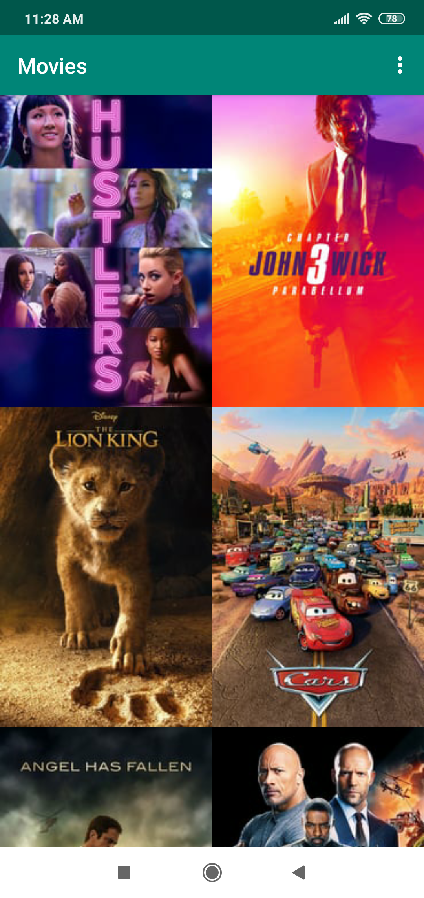
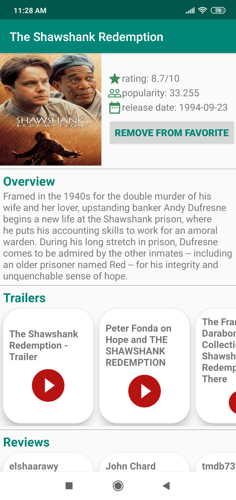
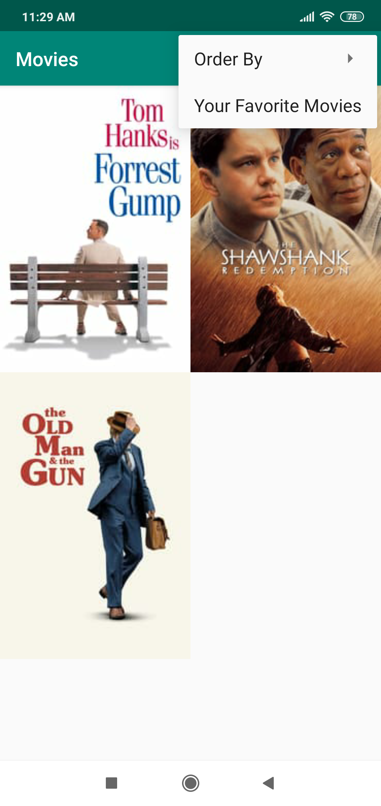

# PopularMoviesWithRoom - Android Developer Nanodegree Project
This project is an Android App to help users discover popular and recent movies using The Movie Database API 

# Features

* Present the user with a grid arrangement of movie posters upon launch.
* Allow your user to change sort order via a setting:
     The sort order can be by most popular or by highest-rated or favorites.
* Allow the user to tap on a movie poster and transition to a details screen with additional information such as:

          * original title
          
          * movie poster image thumbnail
          
          * an overview 
          
          * user rating 
          
          * release date
* Allow users to view and play trailers  
* Allow users to read reviews of a selected movie.
* Allow users to mark a movie as a favorite in the details view

# Screenshots

